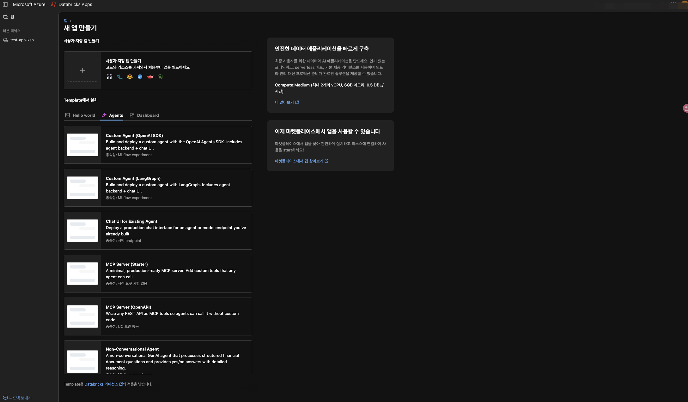
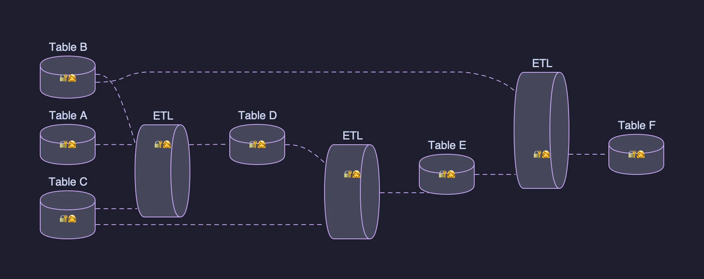

데이터브릭스로 거버넌스 프로젝트를 진행하다 보니 가장 어려운게 관리와 배포인 거 같다.   
새로운 프로젝트나 개발환경을 타팀에서 구축하려고 할 때 아래와 같은 사항이 딜레마로 돌아왔다.

1. 클라우드 벤더 리소스와 달리 PaaS 서비스인 데이터브릭스에 대한 깊은 이해가 없다.
2. 리소스 생성 시 Creator(소유자)가 변경이 되지 않는 리소스들이 너무 많다.

1번의 경우는 프로젝트를 진행하는 개발자 또는 이해관계자들이 관심이 있다면 어느 정도 발전이 돼서 크게 문제로 작용하지는 않다고 보지만, 2번의 경우 실제 리소스를 생성하고 난 뒤 "어, 이게 왜 안 바뀌지?" 라면서 적잖이 당황하는 개발자들이 많다.

오늘은 2번과 같은 문제 중심으로 내가 지금 진행하는 프로젝트에서는 어떤 문제가 있고, 어떻게 해결해나가고 있는지를 공유하겠다.

## 이 사람이 퇴사하면 어떻게 되나요?

데이터브릭스를 1년 넘게 공부하고, 구축 및 운영해보면서 느낀 것 중 가장 큰 장점은 **쉽게 리소스를 생성할 수 있다는 점**이지만 **가장 큰 단점 또한 쉽게 리소스를 생성**한다는 점이다.  
말 장난 같아 보일 수 있지만 데이터브릭스는 개발의 자유를 크게 보장한다고 생각한다. 그렇게 생각하게 된 계기는 "앱 생성"이었다.

개인이 데이터나 코딩 역량만 된다면 또는 Genie Agent를 활용할 수 있다면 언제든 워크스페이스에 내가 원하는 앱을 배포할 수 있다. 자칫 무겁게 느껴질 수 있는 애플리케이션 서비스를 가볍게 접근하면서 동시에 다양한 인사이트를 가볍게 받아들일 수 있는 환경이 됐다.  
하지만 동시에 가볍게 받아들이게 되면서 벌어지는 문제를 예상할 수 있다.

1. 프로젝트 개발자가 실제 운영이 필요한 앱 서비스나 Lakeflow Job을 활용한 파이프라인을 자기 신원으로 유지 및 관리
2. 모델 서빙 엔드포인트를 자기 신원으로 UI에서 생성 후 운영 다운 스트림으로 서빙

만약 자기 신원. 즉, 개인 계정으로 생성한 리소스는 lifecycle 관점에서 가장 큰 리스크를 안고 간다.  

아래는 리소스별 Creator인 개인 신원이 삭제됐을 때 영향도를 정리한 표이다.

| 리소스                       | Creator 변경     | 소유자 / 실행 주체 변경    | 개인 신원 삭제 시 영향                   | 권장 배포 주체       |
| ------------------------- | -------------- | ----------------- | ------------------------------- | -------------- |
| Model Serving Endpoint    | 불가 (생성 시 고정)   | 불가                | 치명적 — 갱신·설정 변경 불가. 삭제 후 재생성만 가능 | SP 필수          |
| Databricks App            | 불가             | 제한적               | 배포·갱신 실패 가능                     | SP 필수          |
| Job / Workflow            | 불가 (감사 목적, 불변) | 가능 (Owner·Run as) | Run as가 개인이면 실행 실패              | SP 필수 (run_as) |
| Lakeflow / DLT 파이프라인      | 불가             | 가능 (Run as)       | Run as가 개인이면 실행 실패              | SP 필수          |
| MLflow Experiment / Run   | 불가             | 가능 (권한 ACL 조정)    | 이력 귀속 문제, 관리 주체 불명확             | SP 권장          |
| UC 객체 (테이블·볼륨·모델·함수)      | 해당 없음          | 가능 (Owner 변경)     | Owner가 개인이면 관리 주체 소실            | SP 소유 권장       |
| Dashboard / Alert / Query | 불가             | 가능 (Owner 변경)     | 자격증명 만료 시 갱신 실패                 | SP 권장          |
이처럼 리소스 개발의 목적이 운영 서비스를 위한 목적이라면 실험은 개인신원으로 실제 배포는 데이터브릭스 내 Service Principal(시스템 로봇)으로 배포하는 게 좋고, 이는 공식 문서에서도 권장하는 내용이다.

> *"Databricks recommends creating service principals to run production jobs or modify production data."*
> [identity best practices | Databricks](https://docs.databricks.com/aws/en/admin/users-groups/best-practices#:~:text=Databricks%20recommends%20creating%20service%20principals%20to%20run%20production%20jobs%20or%20modify%20production%20data.)

## 현재 나의 상황은..

현재 내 프로젝트는 아래와 같은 규약으로 가볍게 생긴 데이터브릭스 환경이 존재한다.
- 모든 워크로드는 Serverless Compute로 진행한다.(Lakeflow jobs / Interactive / SQL 등)
- 메인 카탈로그(`project_{dev/prod}`) 하위에 프로젝트 별 스키마에서 모든게 관리된다. 
- 프로젝트 스키마에서는 External Volume까지 기본적으로 제공하며, 그 이후 지지고 볶든 우리는 관여하지 않는다. 즉, 책임은 프로젝트 수행팀에게 존재한다.

막상 규약을 가볍게 잡았을 때는 내가 할 게 없어서 다행이다 싶었는데 좀 더 깊게 생각해보니 데이터 늪(data swamp)가 아니라 데이터브릭스 늪(databricks swamp)가 될 거 같았다.  
우후죽순으로 프로젝트가 생성되기 시작하면 스키마 내에서 MANAGE 권한을 활용하여 자기들끼리 권한을 처리하고(그러다 까먹고), 앱을 생성하고(그러다 까먹고 퇴사하고)..등등 돌이킬 수 없는 강이 될 거 같았다.  

어떻게 하면 신규 프로젝트가 도입했을 때 안전하면서도 플랫폼 관리팀이 통제 가능한 선에서 프로젝트를 진행시킬 수 있을 지 고민하던 찰나 Netflix 또한 Maestro를 운영할 시에 유사한 문제를 직면했고, 그 문제를 'Data Projects'라는 관리 단위로 해결하고 있다는 것을 알게 됐다.

## 사람이 없고, 프로젝트는 남는다.

**Netflix의 Data Project란**,  
관련 데이터 자산(테이블, 워크플로우 등)을 하나의 논리적 컨테이너로 묶고, 그 컨테이너에 사람과 무관한 팀 소유의 합성 신원(synthetic identity)을 부여하는 Netflix의 관리 단위이다.  

*이미지 출처. netflix's data projects post*

Netflix는 이와 같은 관리 단위를 만든 이유는 내가 직면한 문제와 비슷하다.
- **조직 개편 마찰**: 팀 개편 또는 합병 때마다 수백 ~ 수천 테이블의 개별 ACL 수정으로 **결과적으로 지원 요청 폭주 또는 전사 과잉 권한 부여**
- **개인 신원 취약성**: 워크플로우가 개인 엔지니어 신원으로 실행. **팀 이동/휴직/퇴사 시 워크로드 깨짐.** 
이와 같은 문제를 Netflix는 아래과 같은 

